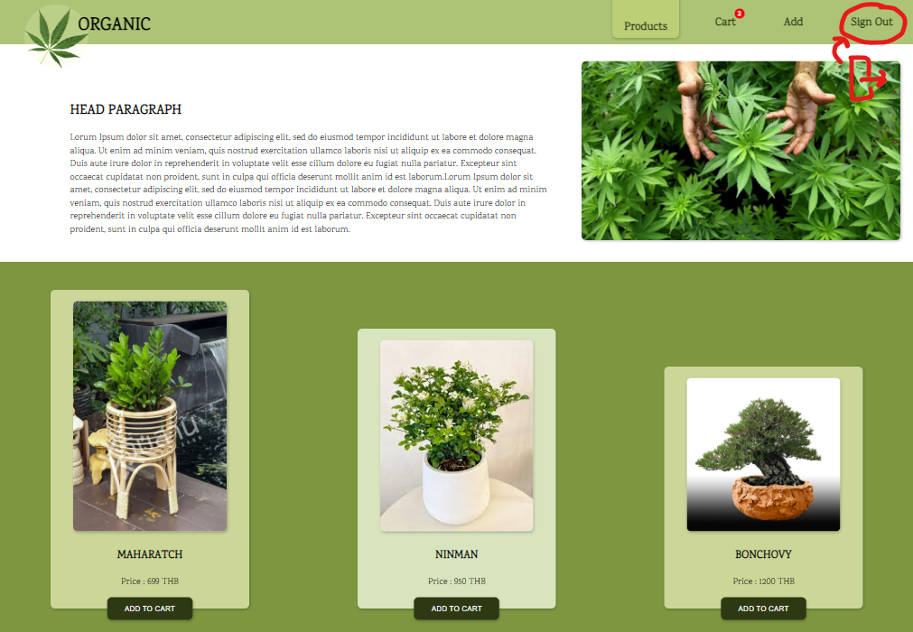

# Organic Store

### Workshop using React && Redux
 

*** *__ยังไม่เสร็จสมบูรณ์__* 
 เหลือ popup นิดหน่อย และนำขึ้น firebase 

ไม่มีฐานข้อมูลใช้การจำลองข้อมูลผ่าน state ทั้งหมด

[UI Design && Design System By Figma](https://www.figma.com/file/w9faV4JyWKfMa7yNbcgSaO/Organic-Workshop?node-id=0%3A1)

มี Respnsive 3 ขนาดหลักอิงตาม Bootstrap 
- 991px Lg
- 768px Md
- 576px Sm

1.ทดสอบด้วย **_npm start_**

2.เมื่อเปิดขึ้นมาจะเจอหน้าหลักที่ยัง **_ไม่เข้าสู่ระบบสมาชิก_** ในหน้านี้เมื่อกด   
**_Add To Cart_** ที่ product card ด้านล่างจะวิ่งเข้าสู่หน้า Sign In

3.เมื่อเข้าสู่หน้า Sign In ใช้ข้อมูลด้านล่าง เพื่อเข้าสู่ระบบ
 Email: admin@gmail.com
 Password : 1234

 

4.เมื่อ signIn เข้ามาแล้วหน้าหลักจะมีฟังก์ชัน ดังต่อไปนี้
 
- สามารถกด **_Add To Cart_** เพื่อเพิ่มสินค้าลงใน Cart มีตัวเลขนับจำนวนสินค้า และสามารถเข้าไปดูชนิดสินค้าราคารวมได้ใน **_Cart_** 
     
    
- สามารถใส่ Code ส่วนลดได้ในช่อง **input** (ทดสอบด้วย ABC123456 ลด 100บาท) 
    

- เลือกหัวข้อ **Add** 

  - สามารถเพิ่ม **Product** ในหน้าหลักได้ (ทางฝั่งซ้ายมือ) 
  
  
  
  - สามารถ เพิ่ม Code สำหรับกรอกส่วนลดได้ (ฝั่งขวามือ)
  
  

- สามารถกด หัวข้อ **Sign Out** เพื่อออกจากระบบสมาชิก
     