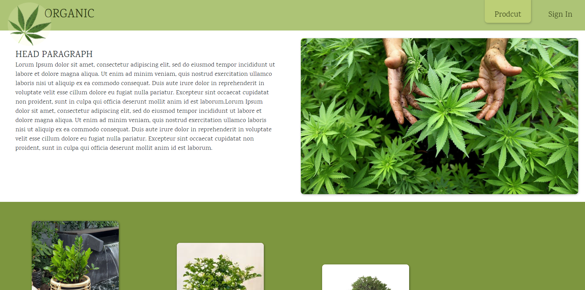

# Organic Store

### Workshop using React && Redux
 

[UI Design && Design System By Figma](https://www.figma.com/file/w9faV4JyWKfMa7yNbcgSaO/Organic-Workshop?node-id=0%3A1)

*** *__ยังไม่เสร็จสมบูรณ์__* 
 กำลังอัพเดทเรื่อยๆ

1. ทดสอบด้วย **_npm start_** โปรเจคยังไม่มีฐานข้อมูล

2. เมื่อเปิดขึ้นมาจะเจอหน้าหลักที่ยัง **_ไม่เข้าสู่ระบบสมาชิก_** ในหน้านี้เมื่อกด   
**_Add To Cart_** ที่ product card ด้านล่างจะวิ่งเข้าสู่หน้า Sign In

3. เมื่อเข้าสู่หน้า Sign In ใช้ข้อมูลด้านล่าง เพื่อเข้าสู่ระบบ **หน้า sigin ยังไม่เสร็จ
 Email: admin@gmail.com
 Password : 1234 

4. เมื่อ signIn เข้ามาแล้วหน้าหลักจะมีฟังก์ชัน ดังต่อไปนี้
 
    - สามารถกด **_Add To Cart_** เพื่อเพิ่มสินค้าลงใน Cart มีตัวเลขนับจำนวนสินค้า และสามารถเข้าไปดูชนิดสินค้าราคารวมได้ใน **_Cart_** (ส่วนนี้ยังไม่เสร็จ)
     

    - สามารถกด **_Add_** เพื่อเพิ่ม Product ลงในหน้าหลักได้โดยการกรอกข้อมูล(ยังไม่เสร็จ)
     

    - สามารถกด หัวข้อ **Sign Out** เพื่อออกจากระบบสมาชิก
     